Step 1: Create a Glue database
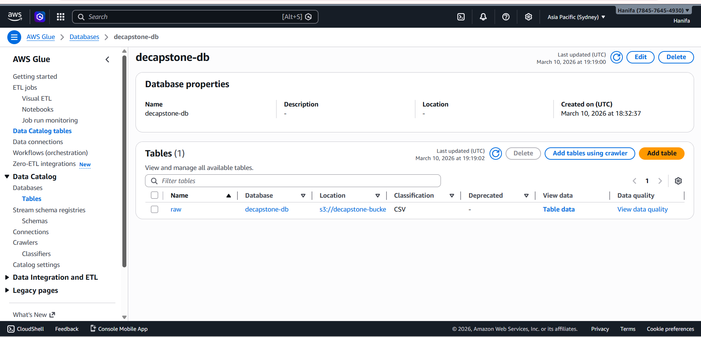

Step 2: Create a Glue Crawler
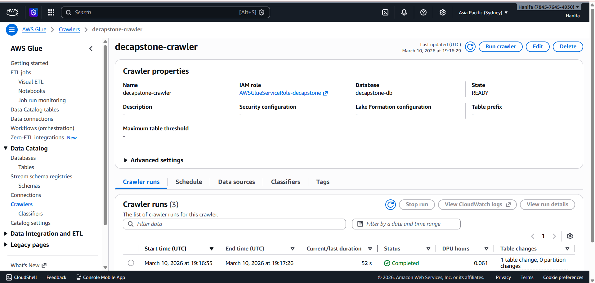

Step 3: table created after running the crawler
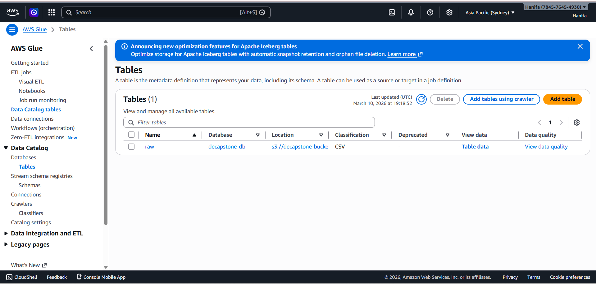

Step 4: Schema retrieved from the crawler
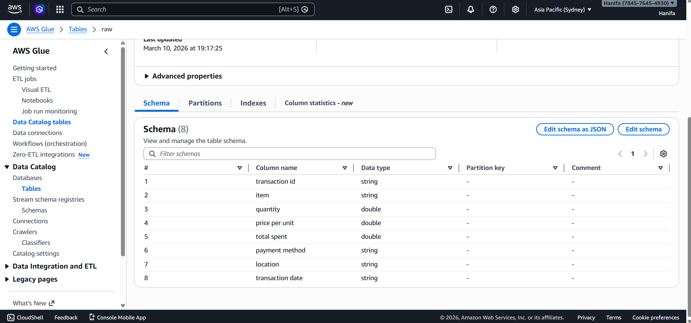

Step 5: pyspark etl job
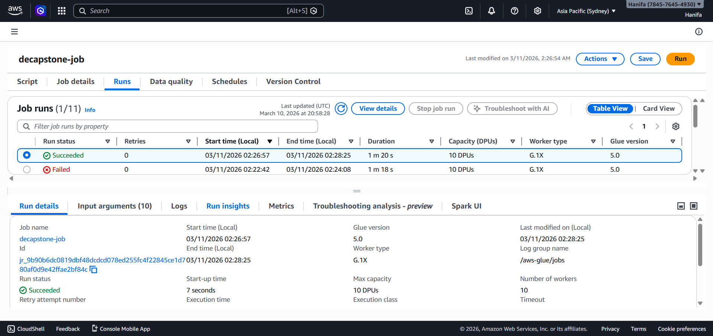

Step 6: etl job running
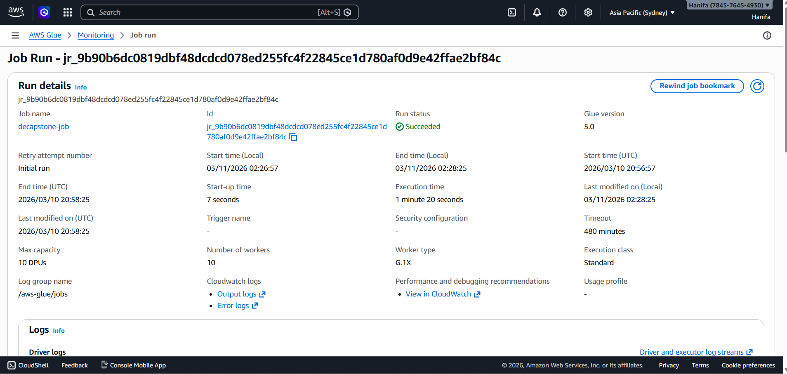

Step 7: job bookmark enabled in ETL

Step 8: the result of the pyspark job is that the cleaned_data.csv file in raw folder of S3 is partitioned and saved in curated folder of S3 after partitioning on the basis of year and month of transaction date.
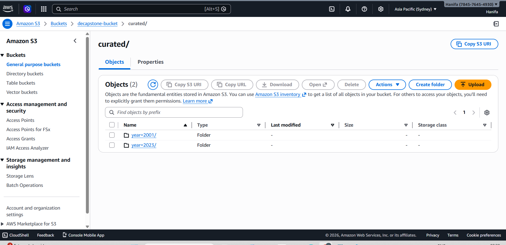

Step 9: Partitioned data in curated folder
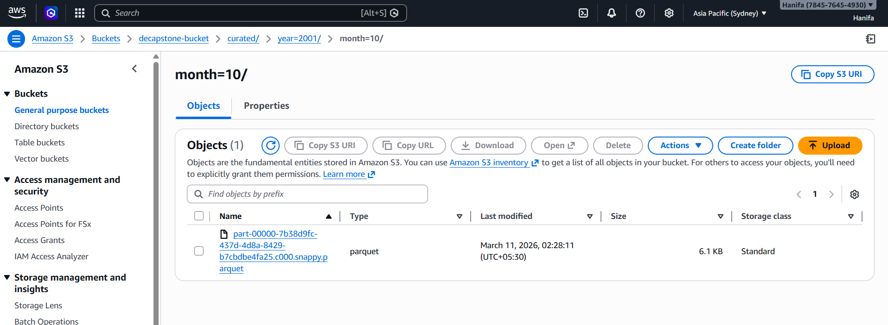

Step 10: Partitioned data

Step 11: Create a crawler for partitioned data in curated folder in s3
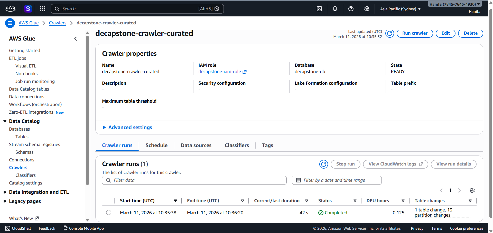

Step 12: table created after running crawler
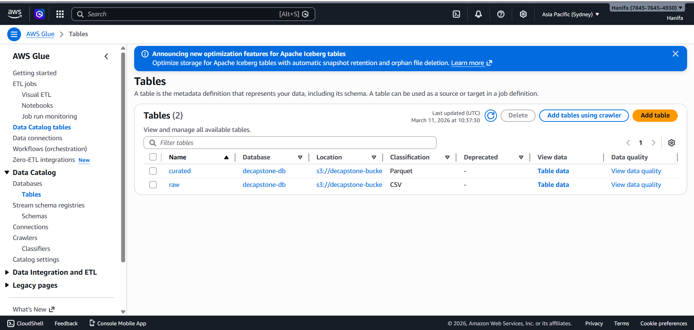

Step 13: schema retrieved after running crawler
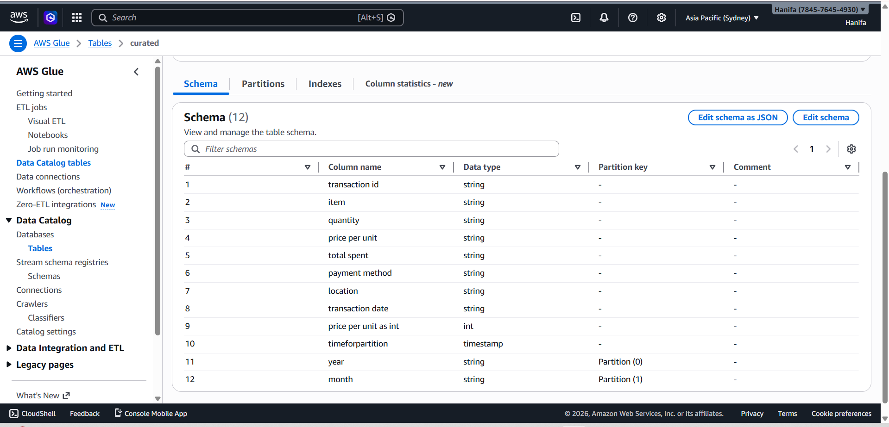

Step 14: In aws Data lake formation create an administrator using root account and register data location as raw and curated folders in s3
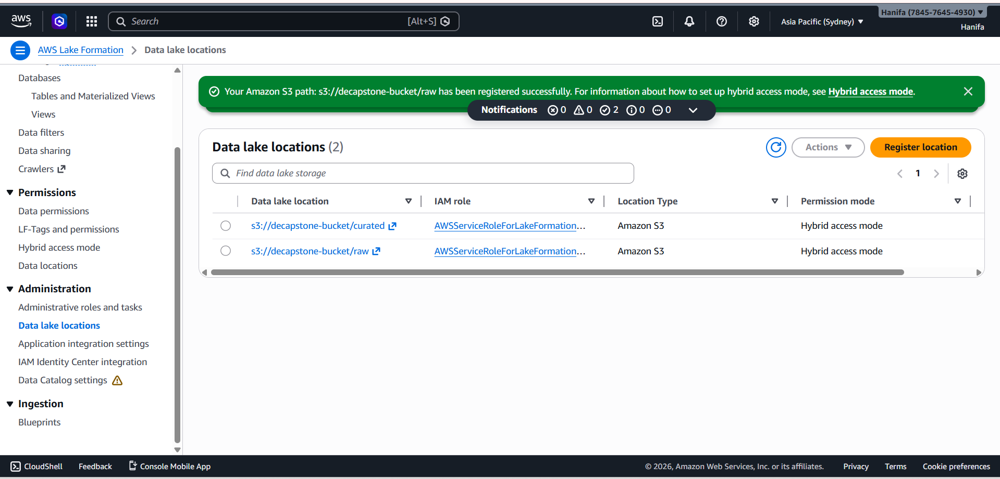

Step 15: create an iam role with restricted permission for raw folder and full permission for curated folder

Step 16: write the test glue job to check if iam user can access curated and not access raw
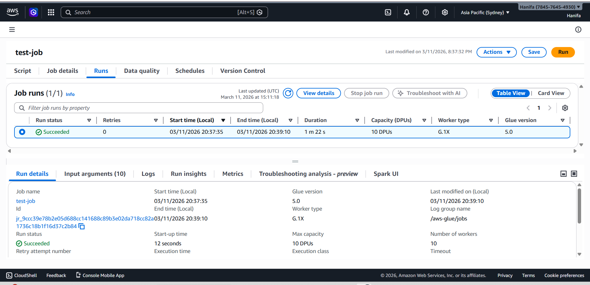

Step 17: login using iam user and write athena query for curated
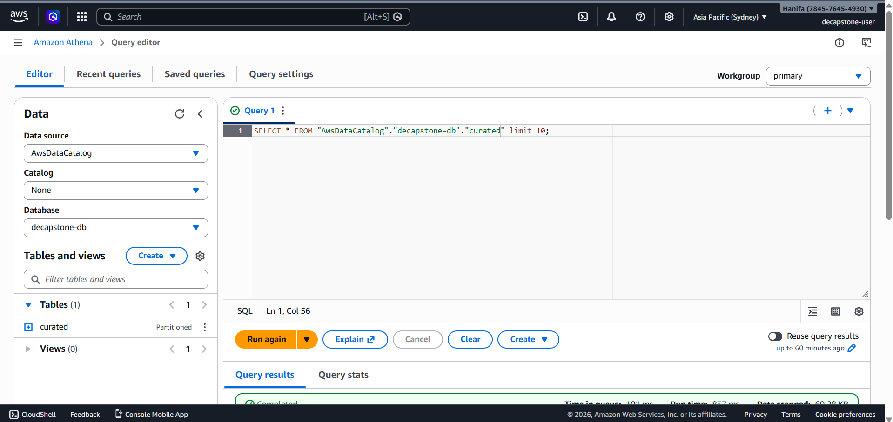

Step 18: result for athena query
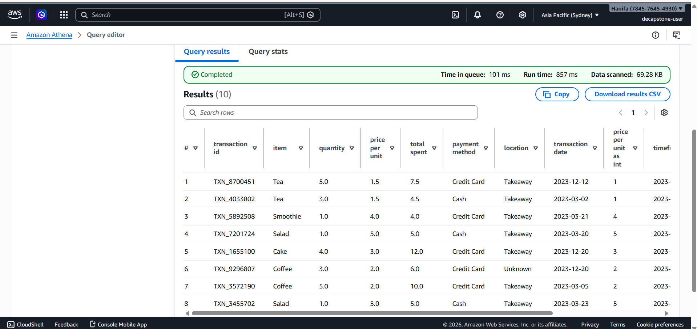

Step 19: result for athena query for raw (as raw folder was restricted for this user)
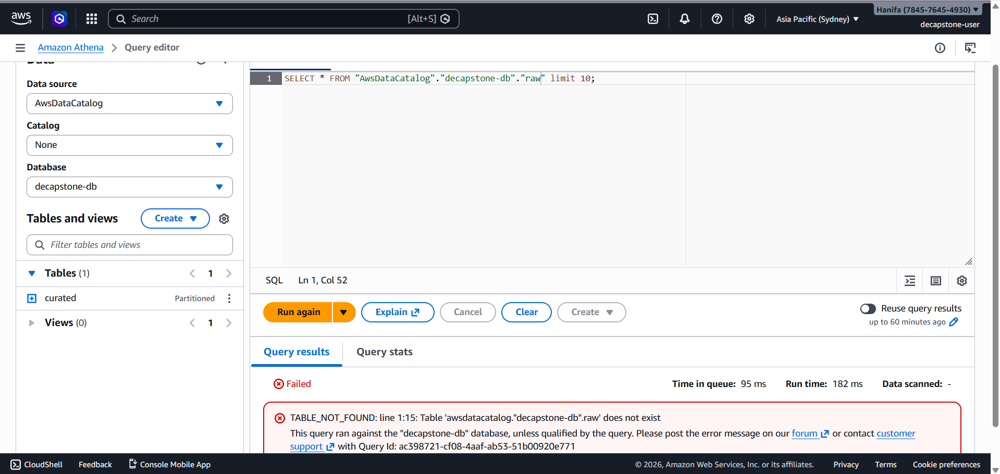

Step 20: write CTAS query
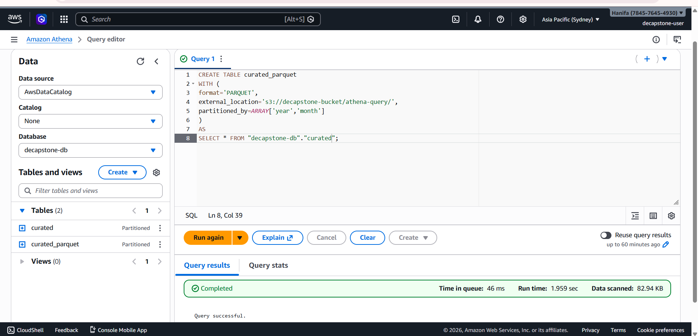

Step 21: run time for query for partitioned data after using CTAS
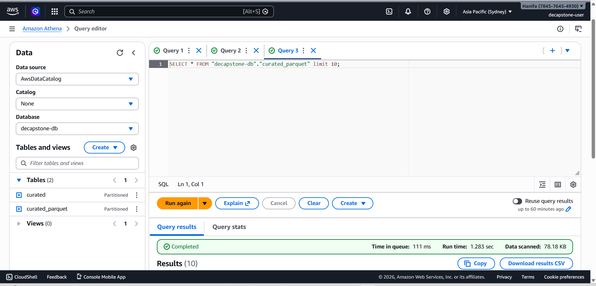

Step 22: run time for query for partitioned data before using CTAS
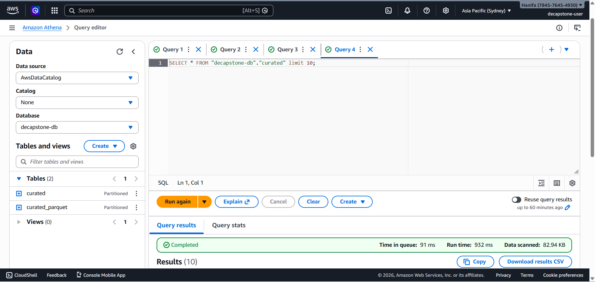