Question 4-
Step 1: Create a Glue etl job
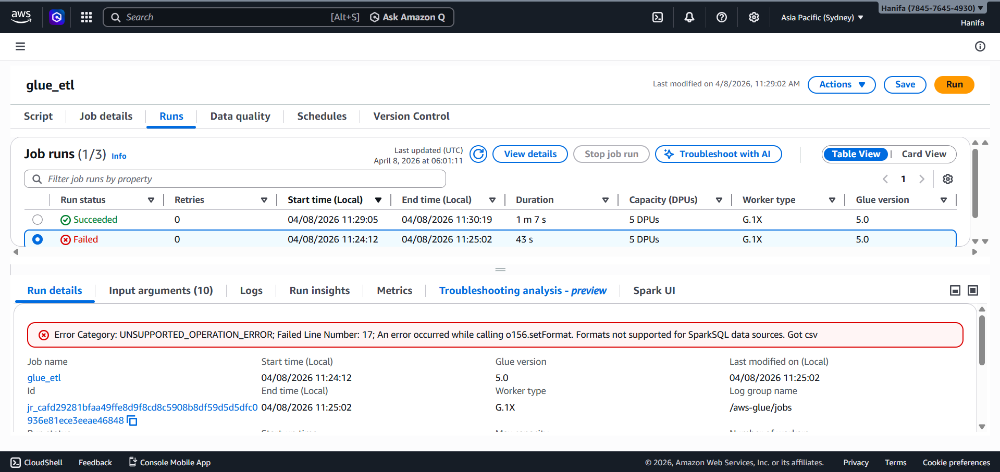

Step 2: Glue etl writes the transformed data in parquet format to s3 
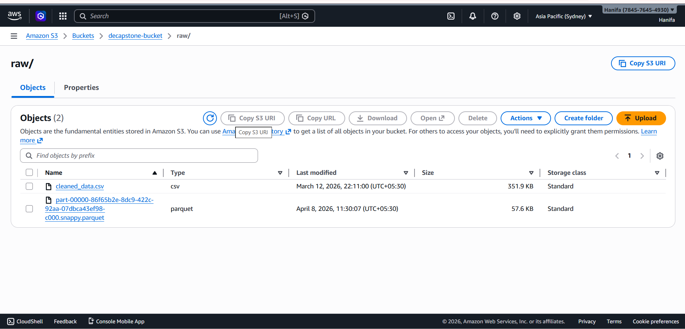

Step 3: run the crawler
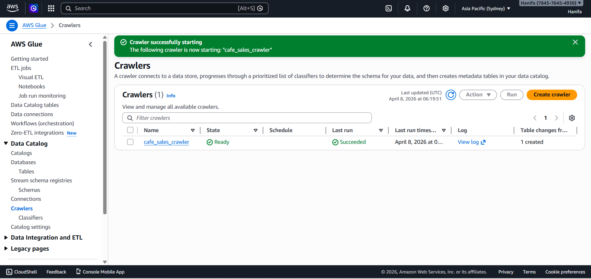

Step 4: Running athena query
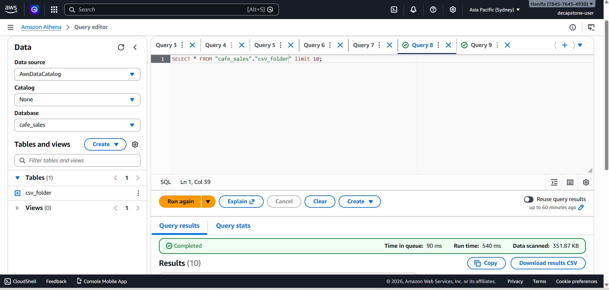

Step 5: setting up subscription in sns
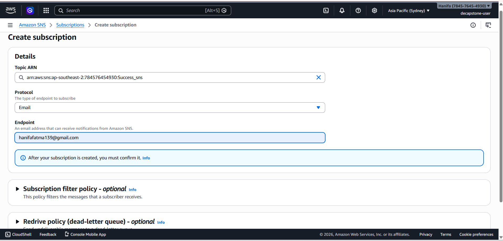

Step 6: create state machine in step function
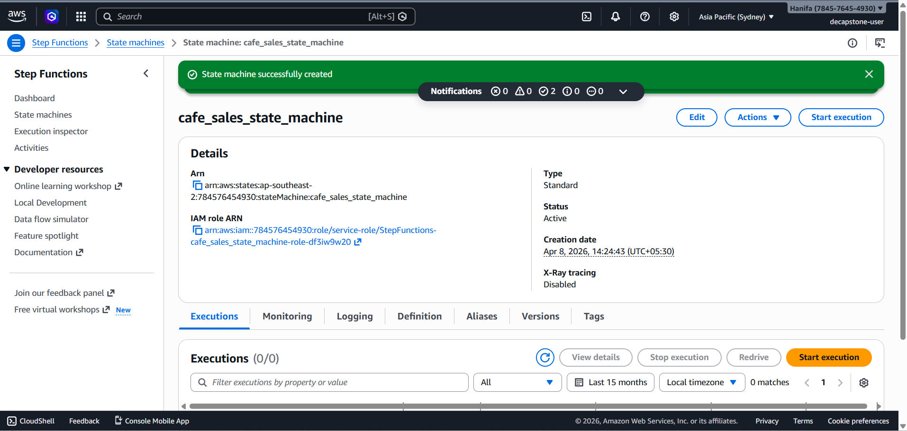

Step 7: Execute the step function
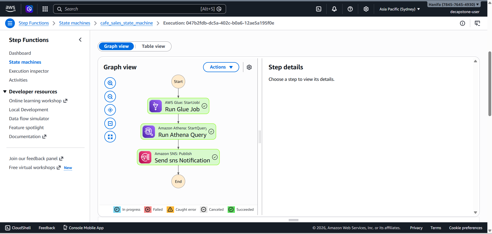

Step 8: Successfully executed the step function
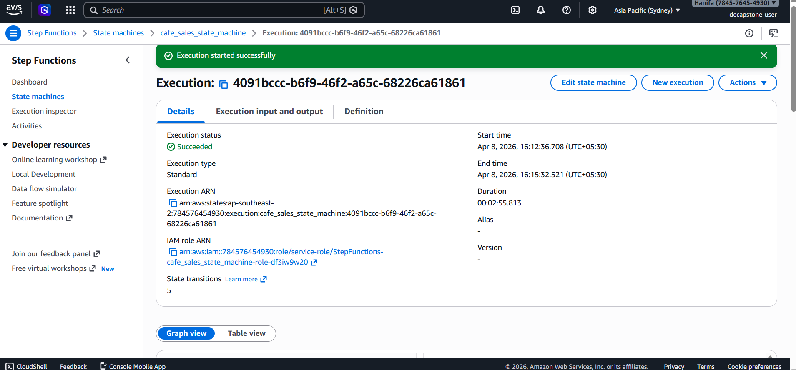

Step 9: Received a notification in email from sns
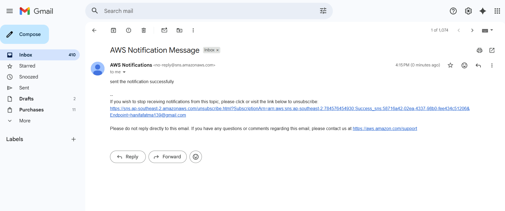

Question 6-

Step 1: write lambda function
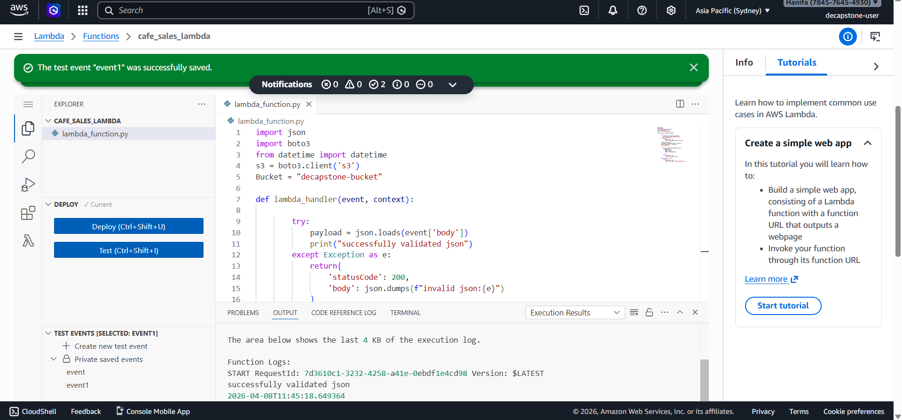

Step 2: creating rest api 
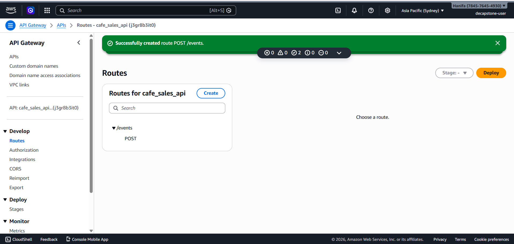

Step 3: enable cors
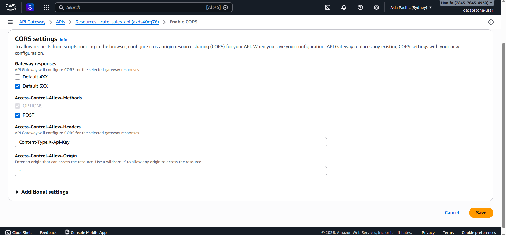

Step 4: resources of the api
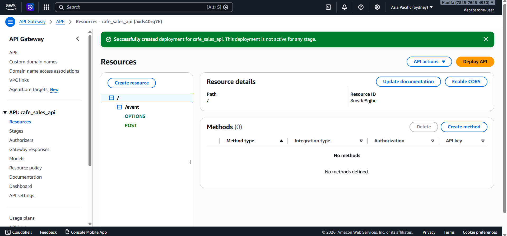

Step 5: api_created
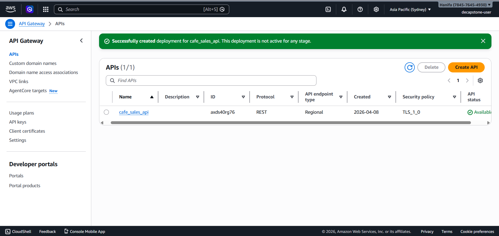

Step 6: setting up usage plan and api key
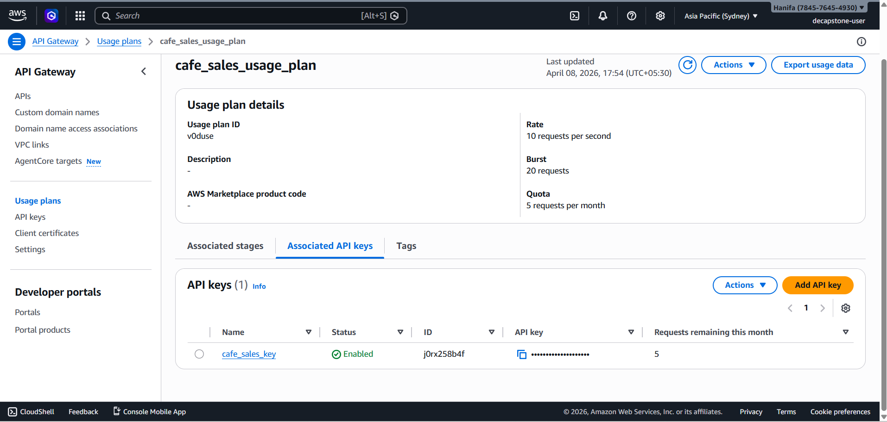

Step 7: testing with thunderclient
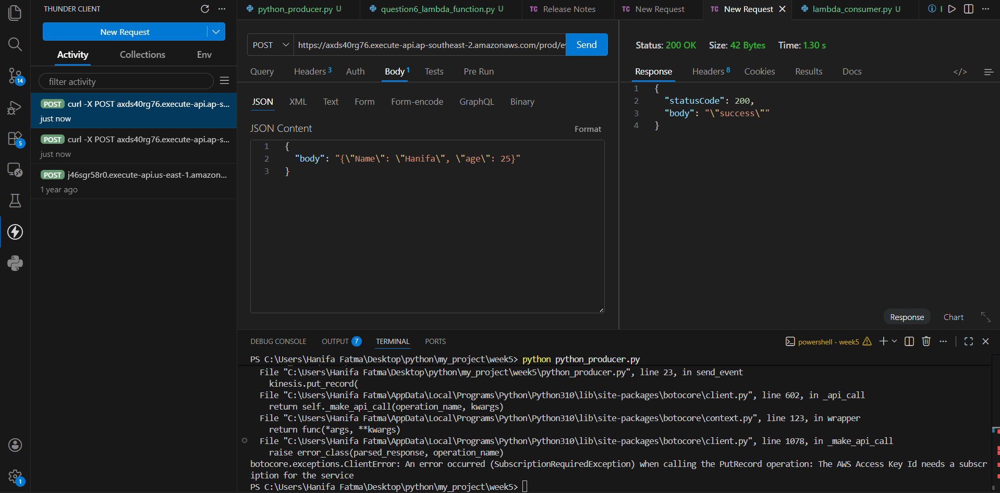

Step 8: file uploaded to s3
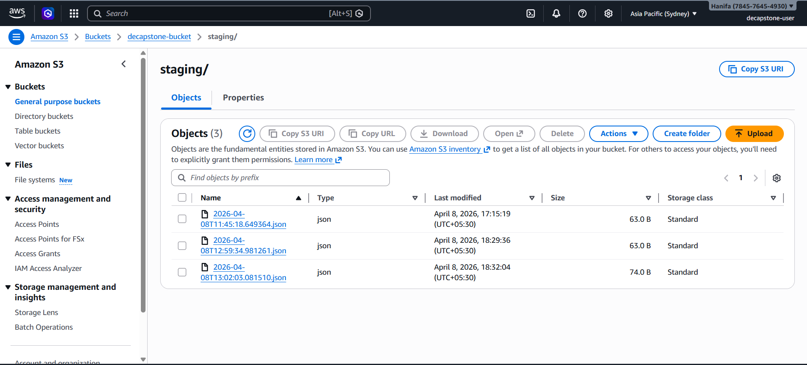
