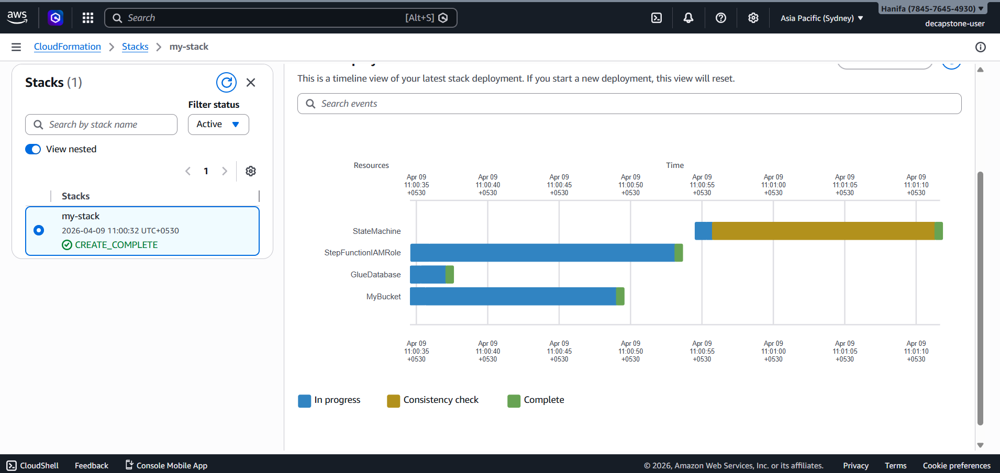
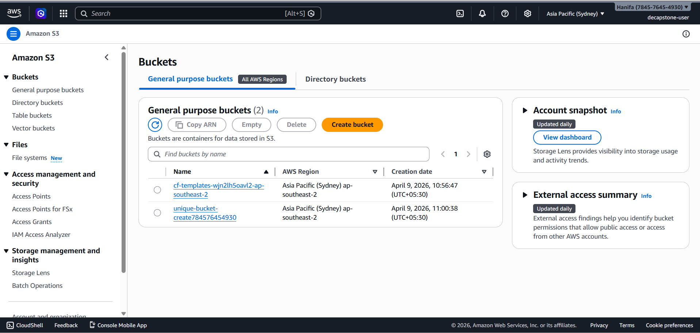
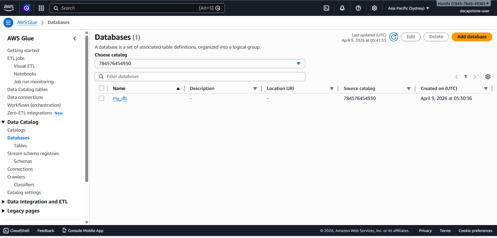
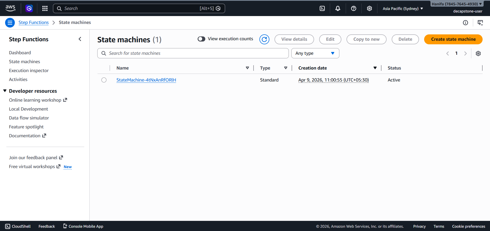
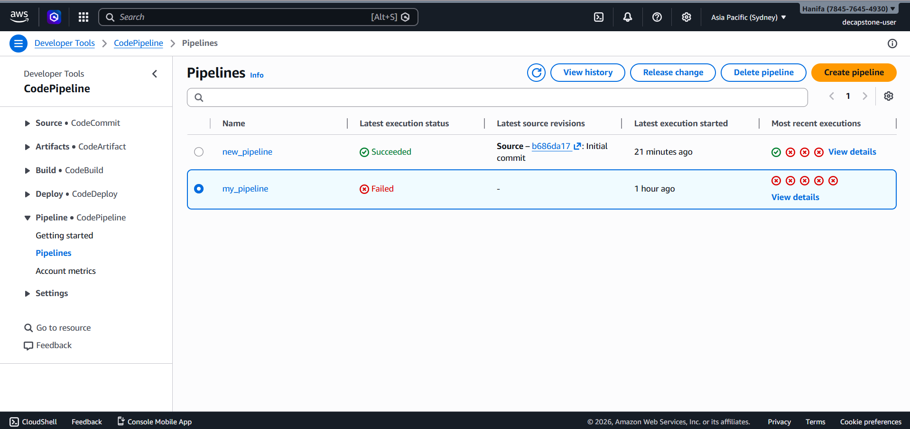
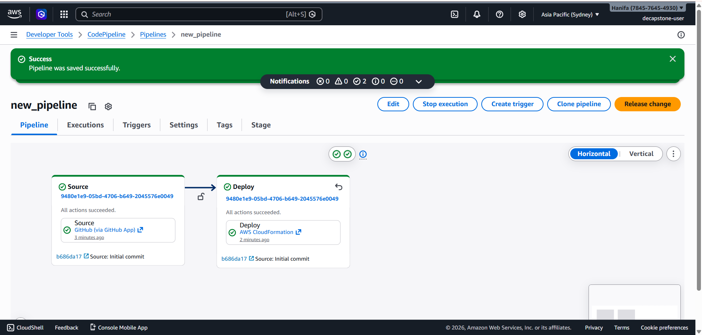
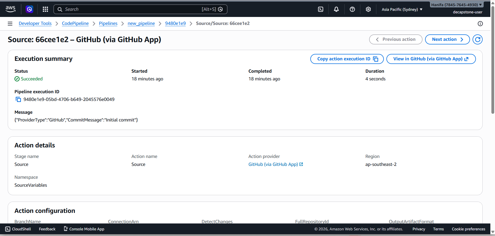
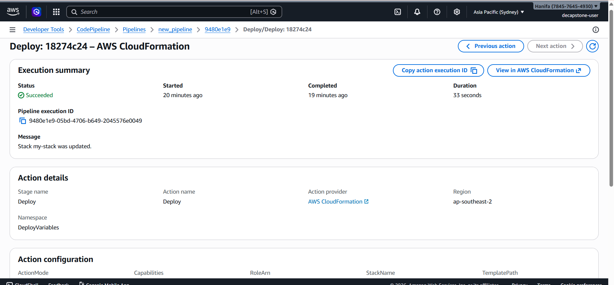

Step 1: Create a cloudformation stack

Step 2: bucket created after running cloudformation stack

Step 3: Glue database created from cloudformation

Step 4: State machine created from cloudformation

Step 5: pipeline created 

Step 6: pipeline created and in running state

Step 7: pipeline source

Step 8: pipeline deploy

