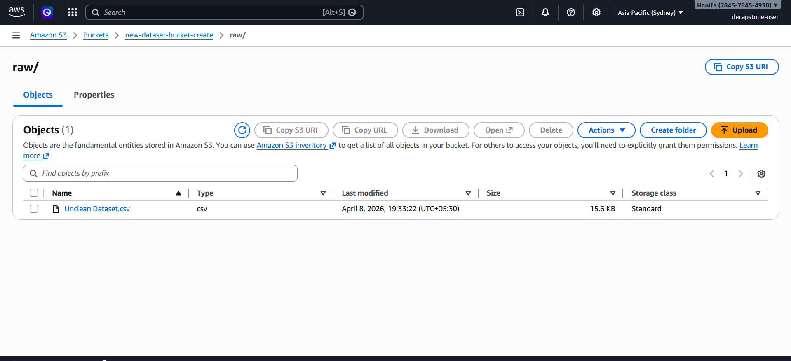
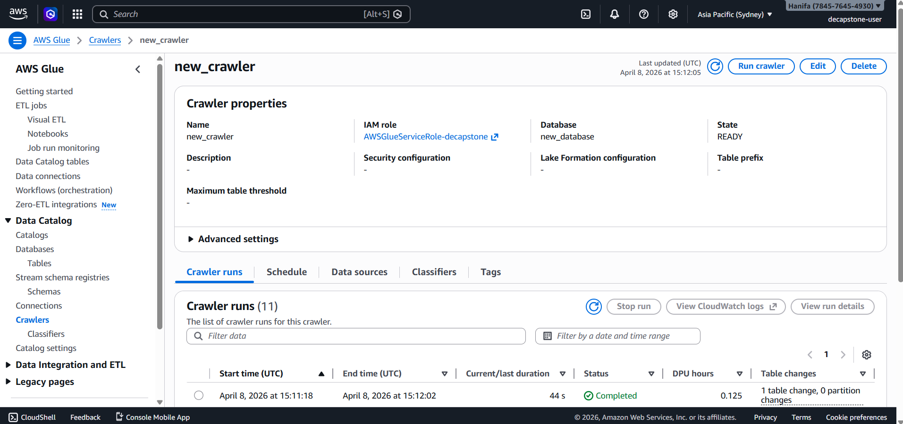
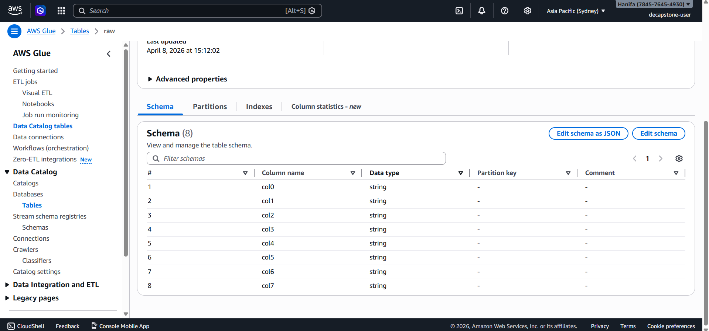
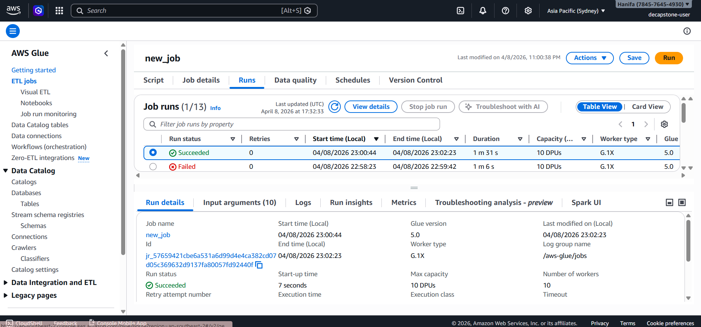
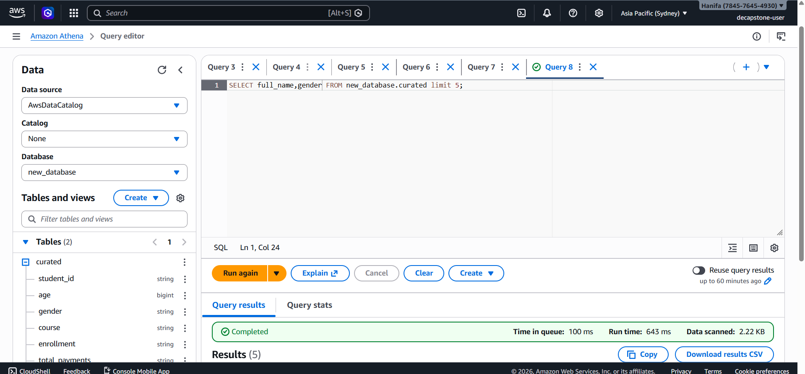
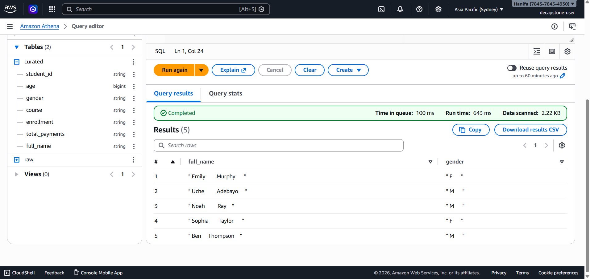
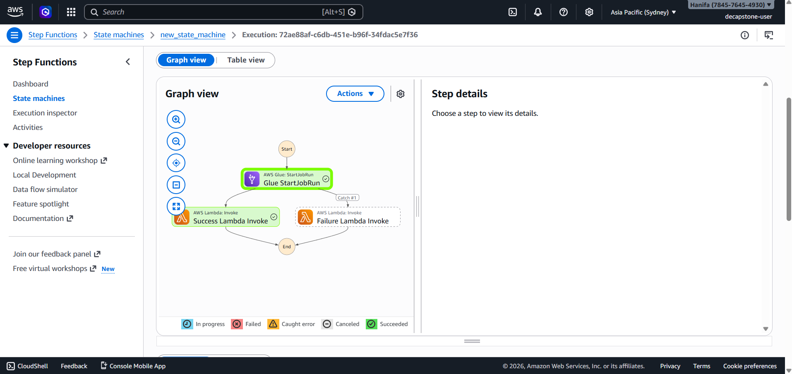
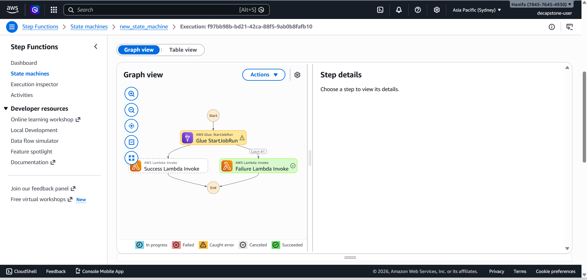

Step 1: upload an uncleaned dataset in s3 

Step 2: Run Glue Crawler

Step 3: schema retrieved after running crawler

Step 4: create a glue job doing some transformation

Step 5: Run athena query on cleaned file in curated folder

Step 6: athena query result

Step 7: Step function invoking lambda on success

Step 8: Step function invoking lambda on failure

